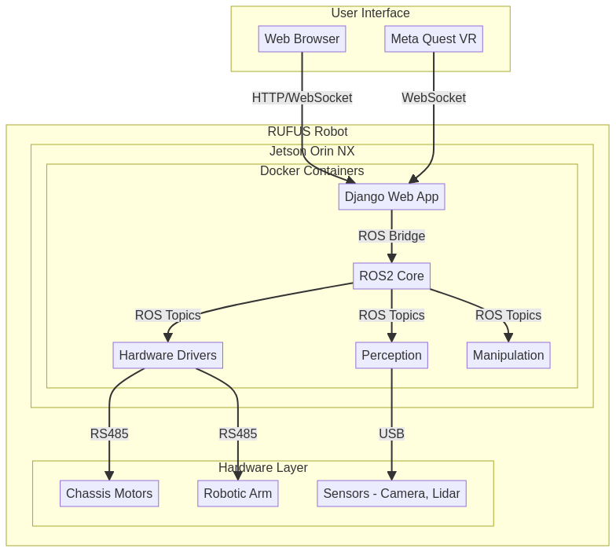

# RUFUS: Complete System Architecture

## 1. Introduction

RUFUS (Robotic Universal Field Utility System) is a sophisticated mobile manipulation platform designed for versatility and advanced control. This document outlines the complete system architecture, integrating a tracked chassis, a 6-DOF robotic arm, a powerful edge AI computer, and a multi-modal control interface including a web UI and immersive VR teleoperation. The design is based on the Hiwonder LanderPi architecture but utilizes upgraded hardware from Waveshare and a custom software stack.

## 2. High-Level Architecture

The system is divided into three primary layers: the **User Interface Layer**, the **Robot Control Layer** (on the Jetson Orin NX), and the **Hardware Layer**. Communication between the user and the robot is mediated by a Django web server, which uses WebSockets for real-time data streaming and a ROS2 bridge for robot control.

## 3. Hardware Architecture

The hardware architecture is centered around the Jetson Orin NX, which acts as the central brain of the robot. It interfaces with all motors, servos, and sensors via USB-to-RS485 converters and direct USB connections.

### Component Interconnection

| Component | Connection to Jetson | Protocol | Power Source |
|---|---|---|---|
| **Chassis Motors (4x DDSM315)** | USB-to-RS485 Converter 1 | RS485 | 18V from PMU |
| **Arm Servos (6x ST3215)** | USB-to-RS485 Converter 2 | RS485/TTL | 12V from PMU |
| **Depth Camera** | USB 3.0 Port | USB | 5V from Jetson |
| **Lidar** | USB 2.0 Port | USB | 5V from Jetson |
| **IMU (on Motor Controller)** | Via Motor Controller | I2C/SPI | 5V from PMU |

### Power Architecture

A central Power Management Unit (PMU) is responsible for distributing power from the main battery to all components. 

- **Main Battery**: A high-capacity LiPo battery (e.g., 6S 22.2V) provides primary power.
- **Power Management Unit (PMU)**: A custom or off-the-shelf board with multiple voltage regulators.
  - **24V Rail**: Supplies power to the DDSM315 motor controllers.
  - **12V Rail**: Supplies power to the ST3215 arm servos.
  - **5V Rail**: Supplies power to the Jetson Orin NX and other peripherals (Lidar, USB hubs).
- **Battery Monitoring**: The PMU includes a sensor to monitor battery voltage and current, which is read by the Jetson via I2C or ADC for telemetry.

## 4. Software Architecture

The software stack runs within a multi-container Docker environment on the Jetson Orin NX, orchestrated by Docker Compose. This ensures modularity, isolation, and easy deployment.

### Docker Container Architecture

| Container | Base Image | Key Packages | Purpose |
|---|---|---|---|
| `ros2-core` | `dustynv/ros:humble` | `navigation2`, `slam_toolbox`, `robot_localization` | Core ROS2 services, navigation, and SLAM. |
| `drivers` | `dustynv/ros:humble` | `pyserial`, `crcmod` | Low-level hardware drivers for chassis and arm. |
| `perception` | `dustynv/ros:humble` | `image_transport`, `cv_bridge`, `yolov8` | Camera/Lidar processing, AI vision. |
| `manipulation`| `dustynv/ros:humble` | `moveit2`, custom controllers | Arm motion planning and execution. |
| `web-backend` | `python:3.10-slim` | `django`, `channels`, `roslibpy` | Web server, WebSocket handling, ROS bridge. |
| `web-frontend`| `node:20-alpine` | `react`, `vite`, `three.js` | User-facing web interface. |
| `rosbridge` | `dustynv/ros:humble` | `rosbridge_server` | Provides WebSocket interface to ROS2. |

### ROS2 Node Architecture

The ROS2 workspace is organized into several packages, each containing nodes that perform specific functions.

- **`rufus_bringup`**: Launch files to start the entire robot system.
- **`rufus_drivers`**: Nodes for communicating with DDSM315 and ST3215 servos.
- **`rufus_description`**: URDF and xacro files describing the robot's physical structure.
- **`rufus_navigation`**: Configuration for Nav2 and SLAM Toolbox.
- **`rufus_perception`**: Nodes for processing camera and Lidar data.
- **`rufus_manipulation`**: MoveIt2 configuration and custom arm controllers.
- **`rufus_teleop`**: Nodes for handling teleoperation commands from web and VR.

## 5. Communication Architecture

Communication is managed through a combination of ROS2 topics/services, WebSockets, and serial protocols.

### Internal Communication (ROS2)

- **/cmd_vel**: `geometry_msgs/Twist` - Commands for chassis velocity.
- **/joint_states**: `sensor_msgs/JointState` - Real-time position of arm and chassis joints.
- **/odom**: `nav_msgs/Odometry` - Odometry data from chassis encoders.
- **/scan**: `sensor_msgs/LaserScan` - Lidar data.
- **/image_raw**: `sensor_msgs/Image` - Raw camera feed.
- **/depth/image_raw**: `sensor_msgs/Image` - Depth camera feed.
- **/tf** & **/tf_static**: `tf2_msgs/TFMessage` - Coordinate frame transformations.
- **/diagnostics**: `diagnostic_msgs/DiagnosticArray` - System health and status.

### External Communication (Web & VR)

- **Web UI to Backend**: HTTP for requests, WebSocket for real-time control and telemetry.
- **VR App to Backend**: WebSocket for streaming controller poses and receiving telemetry.
- **Backend to ROS2**: The Django backend uses the `roslibpy` library to connect to a `rosbridge_server` node, allowing it to publish and subscribe to ROS2 topics, call services, and interact with actions.

## 6. Control Flow

### Web-based Manual Control
1. User interacts with joystick/sliders in the React frontend.
2. Frontend sends control commands (e.g., `{ "type": "chassis_control", "linear": 0.5, "angular": 0.2 }`) to the Django backend via WebSocket.
3. Django backend receives the message, authenticates the user, and validates the command.
4. Backend uses `roslibpy` to publish a `geometry_msgs/Twist` message to the `/cmd_vel` topic.
5. The `rufus_drivers` node receives the message and translates it into RS485 commands for the DDSM315 motors.

### VR Teleoperation
1. The Meta Quest VR app streams the user's hand controller poses (position and rotation) to the Django backend via WebSocket at 30-60 Hz.
2. The Django backend receives the pose data.
3. A dedicated `vr_teleop` ROS2 node, subscribed to pose data via the ROS bridge, performs inverse kinematics (IK) to calculate the required joint angles for the SO-101 arm.
4. The IK solver publishes the target joint angles to a `/joint_trajectory_controller/joint_trajectory` topic.
5. The `rufus_drivers` node for the arm receives the trajectory and sends the corresponding serial commands to the ST3215 servos.

### Autonomous Navigation
1. User sets a goal destination in the web interface.
2. The frontend sends the goal to the Django backend.
3. The backend uses `roslibpy` to call the `/navigate_to_pose` action server provided by the Nav2 stack.
4. Nav2 plans a path, avoids obstacles using Lidar/camera data, and publishes velocity commands to `/cmd_vel`.
5. The chassis driver node executes the velocity commands, and the robot moves to the goal.

## 7. References

- [Hiwonder LanderPi Documentation](https://docs.hiwonder.com/projects/LanderPi/en/latest/)
- [Waveshare DDSM315 Wiki](https://www.waveshare.com/wiki/DDSM315)
- [jetson-containers for ROS2](https://github.com/dusty-nv/jetson-containers)
- [Django Channels Documentation](https://channels.readthedocs.io/)
- [roslibpy Documentation](https://roslibpy.readthedocs.io/)

